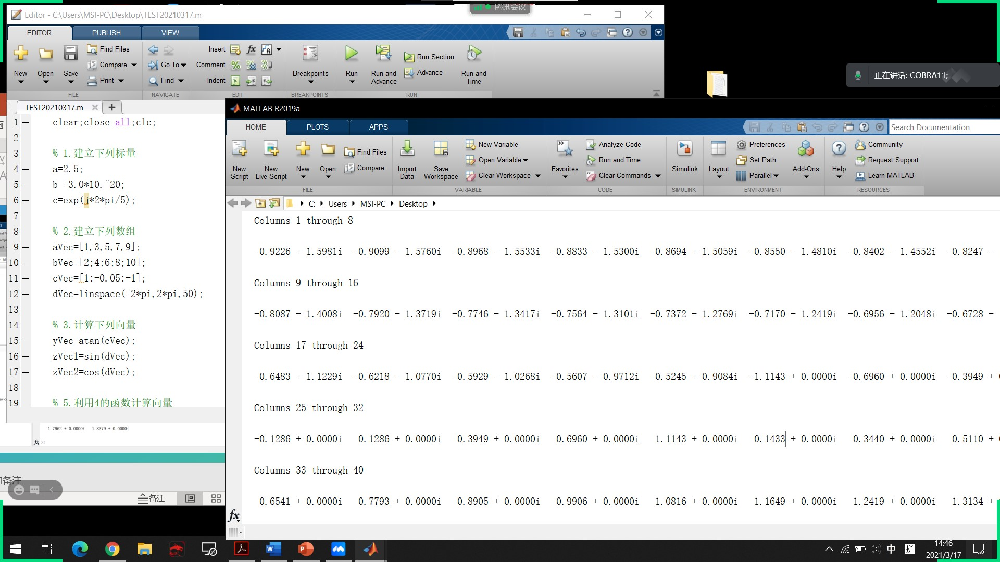
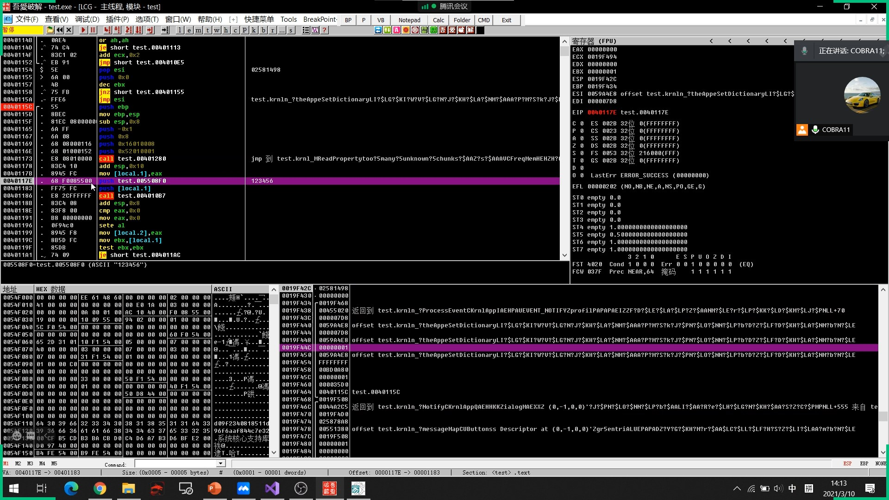
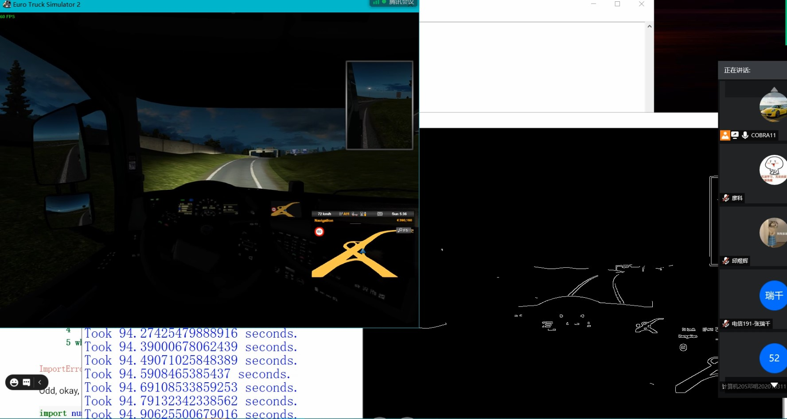

## 社团介绍

海智人工智能俱乐部是学生们自愿结成的非盈利性质社会组织，为兴趣爱好社团，致力于学习人工智能前沿知识。

#### 社团标志内涵

AIC代表Artificial Intelligence Club，SMU代表上海海事大学，环绕圆心的图像表示了人工智能与人类的紧密相连。

#### 社团口号：共同努力，开创未来

#### 社团宗旨：为人工智能的发展未来努力奋斗

#### 社团主营业务：承办人工智能相关讲座，组织人工智能竞赛等活动

### 部门介绍

#### 编程部门

编程部门负责基础的程序语言教学，和组织高级语言程序设计讲座，以及一些算法的介绍

图1 2020/10/21 C++基础教学活动

图2 2020/11/5 Python基础教学活动

图3 2021/3/17 Mablab基础教学活动

#### 机器学习部门

机器学习部门负责对人工智能专项进行深入研究

图4 2020/11/11 Python图像处理教学活动1

图5 2020/11/11 Python图像处理教学活动2

#### 网络安全部门

网络安全部门负责网络竞赛活动的举办与题目的讲解

图6 2021/3/10 反汇编逆向编程教学

#### 智能机器人部门

智能机器人部门负责人工智能在实际的应用

图7 2021/4/7 指纹图像识别教学活动1

图8 2021/4/7 指纹图像识别教学活动2

图9 2021/4/16 Python无人驾驶应用1

图10 2021/4/16 Python无人驾驶应用2

#### 更多部门

更多部门等待新人发掘！

### 招新信息

因疫情原因，招新改为线上进行，来看看我们往年的招新图片吧

图11-12 2021百团大战

加入方式：进入QQ群，即可加入我们的活动和讨论！

图13 海智人工智能俱乐部QQ群

附件[上海海事大学社团章程](../assets/aicsmu/text/上海海事大学社团章程.pdf)

contact: [aicsmu@shmtuaa.org](mailto:aicsmu@shmtuaa.org)

