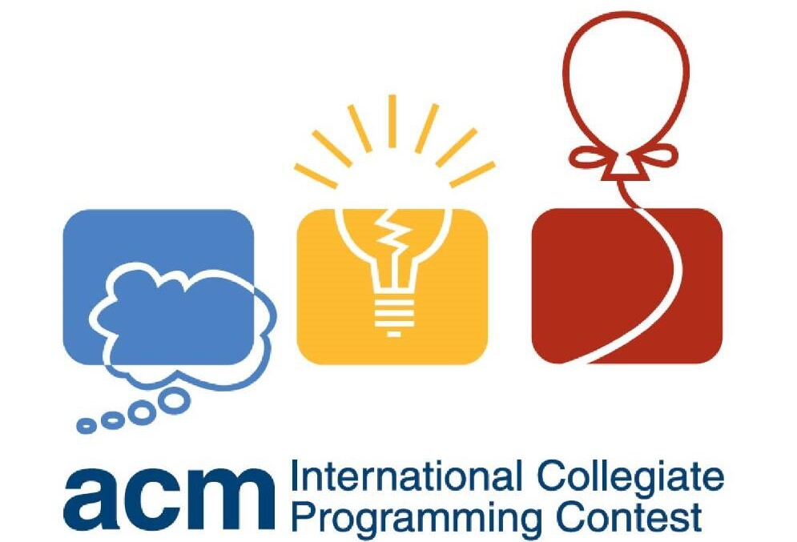
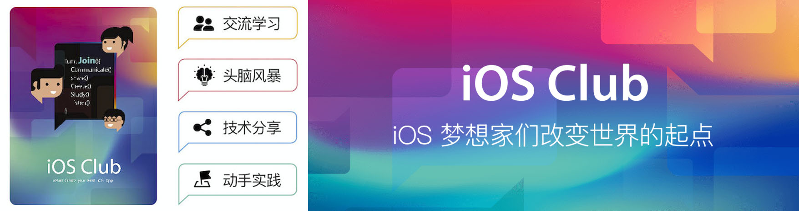
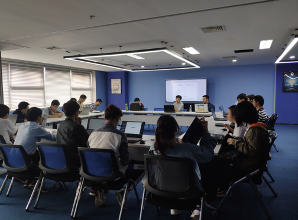
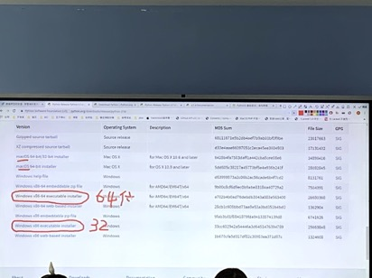
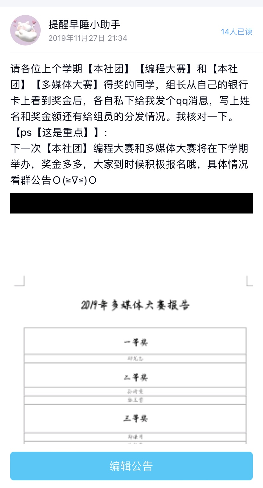
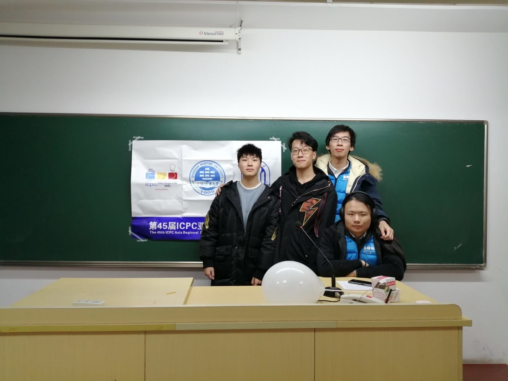
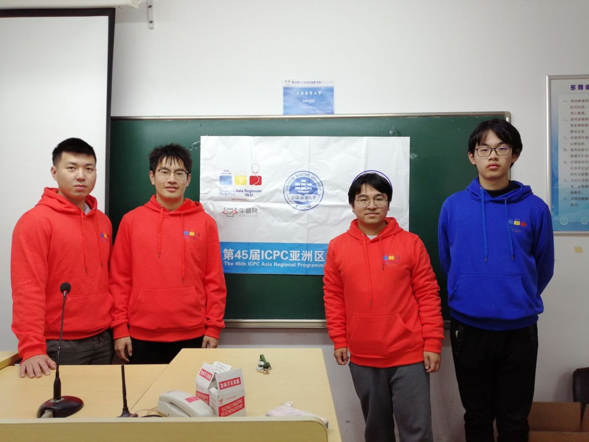
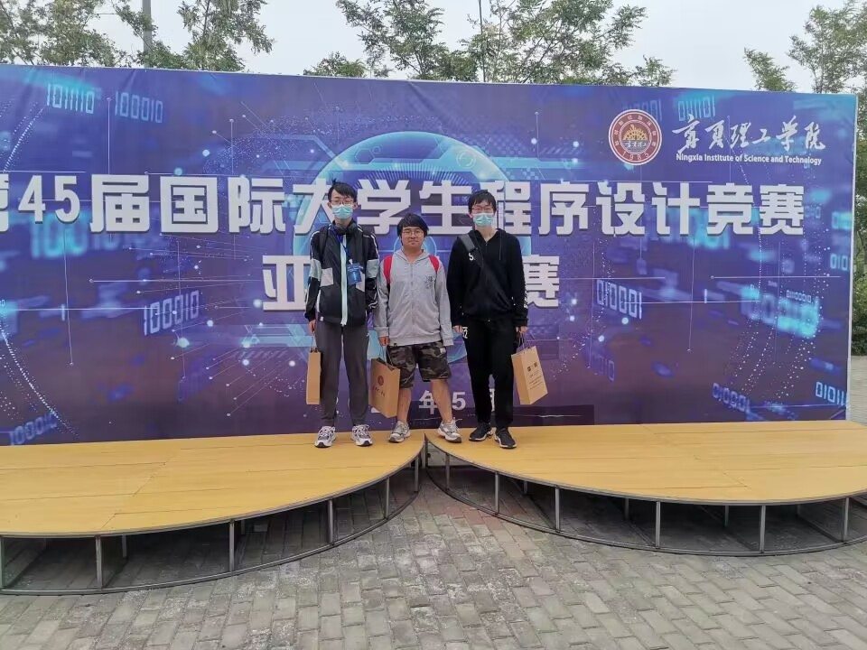

<i>"打破知识壁垒，开创学术先河。"</i>

 ——计算机学会 

<!-- more -->

## 社团介绍

&emsp;&emsp;计算机学科在如今的时代背景之下，属于热门学科之一，我们计算机学会诣在于**给同学们提供一个了解，接触，学习计算机相关学科的平台**。

&emsp;&emsp;"[计算机学会](#caa)"一词，便意味着我们学会是一个**学术研讨型**的社团，我们所追求的是给对计算机学科感兴趣的同学，提供一个**学术探讨**的氛围。在此期间，亦能通过参加各类活动，增加自己的**综测**分数。

<figure class="half">
    
</figure>

## 部门介绍

&emsp;&emsp;为了让同学能够进行更好的学术上的讨论，我们将计算机学会分成了多个部门，以此来更好的给同学们提供更为**针对性的，单领域的课程和服务内容**。

它们是：[算法部](#acm) [网安部](#ctf) [iOS Club部](#ios) [人工智能部](#ai) [多媒体部](#adobe) [宣传部](#wx)

### 算法部
&emsp;&emsp;算法部的活动内容主要是**算法讲座**的召开，和各类**算法竞赛**如：ACM-ICPC，CCPC和蓝桥杯软件组的对接。

<figure class="half">
    
</figure>

### 网安部
&emsp;&emsp;网安部主要面向对**CTF**比赛感兴趣的同学，并且与相应的CTF竞赛对接。

<figure class="half">
    
</figure>

### iOS Club部
&emsp;&emsp;作为社团中新兴成立的部门之一，iOS Club部欢迎所有对iOS感兴趣的同学加入，并且负责和**苹果**方面进行对接，举办高校间夏令营等活动。

<figure class="half">
    
</figure>

### 人工智能部
&emsp;&emsp;**人工智能部门**的主攻方向为**AI方向学术的探讨**，以及**AI的实际应用**。

<figure class="half">
    
</figure>

### 多媒体部
&emsp;&emsp;**多媒体部**主要培养同学们的多维创造能力，在**图片编辑和视频制作**方面进行研讨。

<figure class="half">
    
</figure>

### 宣传部
&emsp;&emsp;**宣传部**主要负责对社团组织的活动进行**宣传**，负责[微信公众号](#wxid)的运营和维护。

---
## 往期活动
&emsp;&emsp;作为一个**极易获取综测**的社团，我们的社团活动也是多种多样的。

### 学科讲座

&emsp;&emsp;为了增加同学们的计算机知识，丰富和拓展同学们的知识面，学会经常举办各类计算机知识及应用相关的讲座，**参与即加综测**。无论你是计算机小白，抑或是在自己的领域上已经有一定的建树，相信这些知识都能帮助你。
同时，我们也会帮助各位愿意分享自己知识的社员开办讲座，并有**丰厚的综测**作为报酬。

<dev align="center">
    <figure class="half">
        
        
    </figure>
</dev>

### 多媒体大赛&编程大赛
&emsp;&emsp;为了提高同学们对于计算机的应用水平，我们也会不定期的举办各类比赛，其中有面向全校的**多媒体大赛**，还有面向学院内的**编程大赛**。
参与其中不但有综测作为**奖励**，更有**奖品奖金**等！

<dev align="center">
    <figure class="half">
        
    </figure>
</dev>

### 竞赛培训
&emsp;&emsp;由于竞赛在学校的**保研**以及企业**招聘**体系的重要性越来越高，因此对于愿意在竞赛领域深耕的同学，我们不但会提供**专业竞赛指导**，而且还会提供**以周为单位的竞赛训练**，并且对于参与的同学，还会有**综测**作为激励，欢迎各位参与。

<dev align="center">
<figure class="half">
    
</figure>
</dev>
&emsp;&emsp;历届竞赛参与图：
<dev align="center">
    <figure class="half">
        
        
        
    </figure>
</dev>

---
## 加入我们

QQ群：
<figure class="half">
    
</figure>

微信公众号: [SHMTU_CAA](https://mp.weixin.qq.com/s/OlLcPUkoYm7rd3IwsAjbcg)

邮件: [caa@shmtuaa.org](mailto:caa@shmtuaa.org)