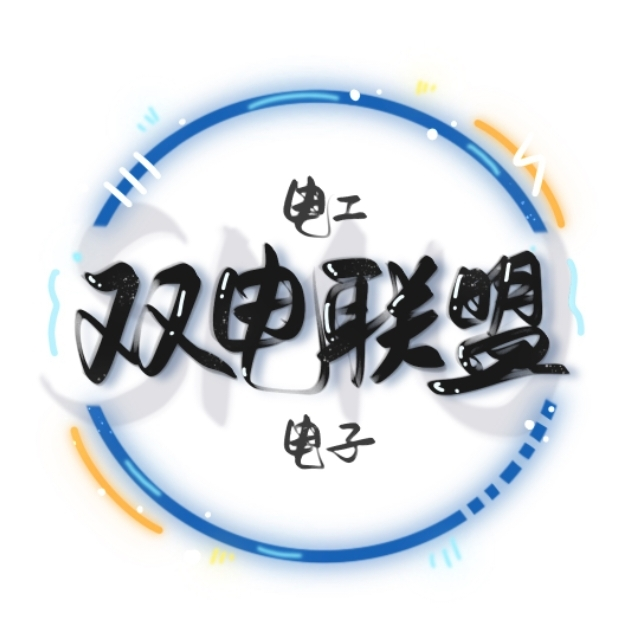
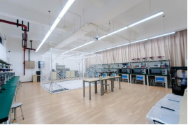
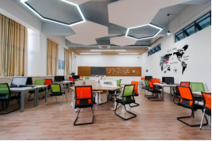
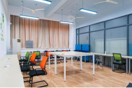
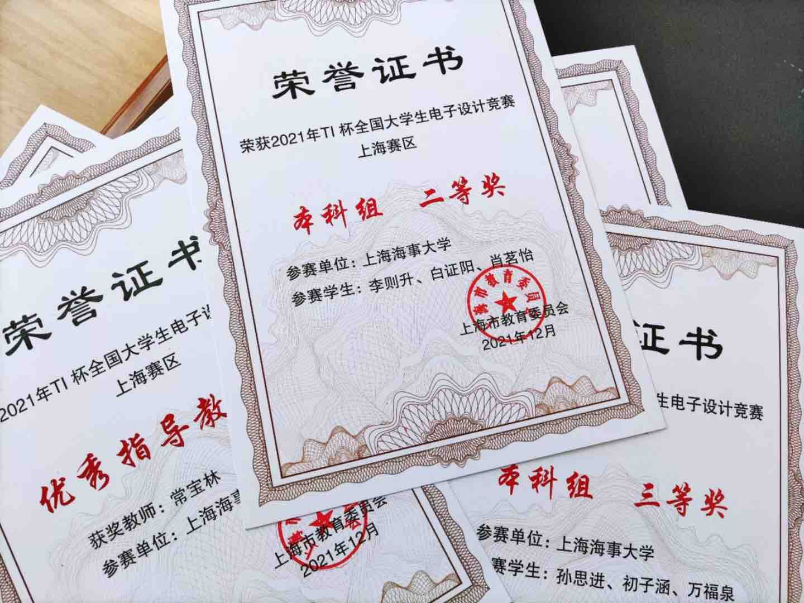
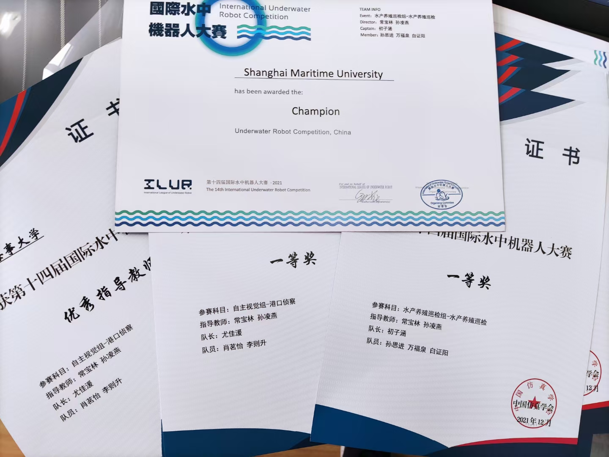
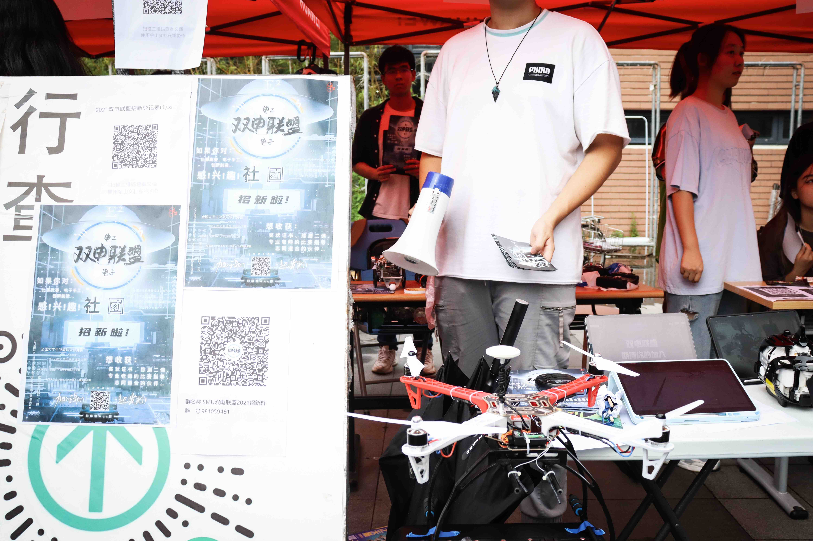
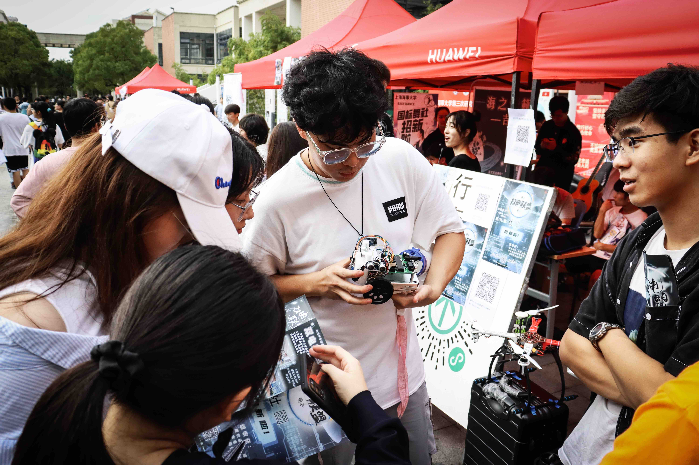
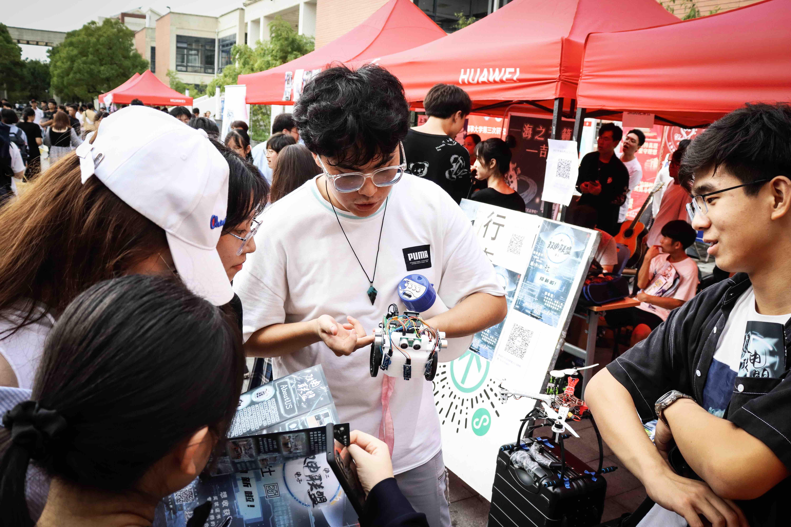
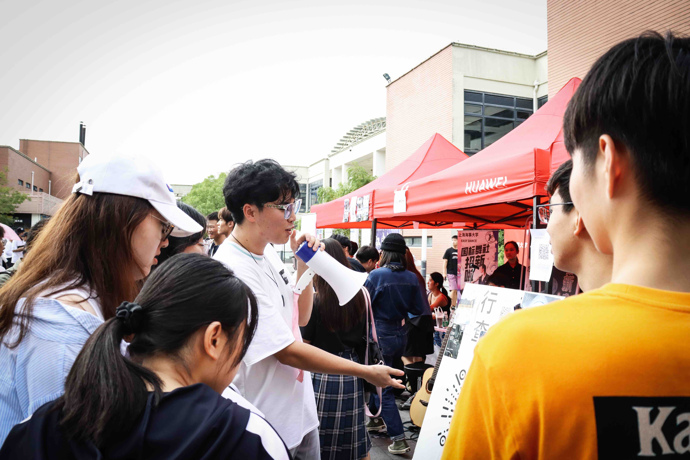

上海海事大学结合一流本科人才培养计划，创建卓越工程师培养平台，旨在培养具有自主创新创业素养的高层次人才。
双电联盟-作为卓越工程师平台下培养大学生创新创业实践动手能力和创新思维意识的培养性社团，结合上海海事大学学科特色，
联合学院学科团队和高新科技产业，目标建设成为在海洋无人自主航行器、海洋水下无人航行器、空中无人飞行器、
智能物流运输机器人、智能物联网系统、智能海洋环境检测、智能光学成像（3D-VR/AR、全息成像）等方面培养学生创新意识、
创新设计、项目规划、实践动手和创业思维等的创新创业示范基地。

双电联盟面向全校大学生开展。着眼提高学生创新创业素养，构建“学科联合+竞赛引导+企业联培”的实践教学培养体系。
结合各方优势资源，搭建优质创新平台，激励引导学生创新实践。

<!-- more -->

为满足学生创新创业实践需求， 双电联盟升级改造实践基地基础建设、配备高端仪器设备、搭建创新实践项目平台和智能实践基地管理系统等。
1. 2018年，配备高新仪器设备和智能化开放式实验室管理系统等，完成对电工电子楼318实验室的升级改造，使之初具创新实验室模型，
同时双电联盟正式开展创新实践教学活动，实现开放型实验室功能，并为参与创新实践的学生提供技术指导；
2. 2019年双电联盟创新实践基地的建设，包括整体平台基础设施建设和环境改造，将电工电子楼314、315、316、318等实验室及走廊
进行了整体的基础环境及设施设备升级改造，使之连成一体，形成创新实践基地模型。
3. 2020年进行双电联盟创新实践平台的第三期建设，建设重点为建设和完善各项创新平台，
* 包括无人机创新实践平台、 机器人创新实践平台、智能水面/水下航行器创新实践平台、智能物联网创新实践平台和智能物流小车创新实践平台，配备高新创新设备和建设完整创新培养方案。
* 继续升级改造基础实践环境，使原电工电子楼316实验室从功能单一的电子制作区域升级为可以提供智能物联网创新实践、智能物流小车创新实践、智能机器人创新实践和电子实践制作的综合性实践平台。
* 利用电工电子楼1楼至3楼楼梯间墙面作为基础教育和创新实践的展示区域，对该区域进行了基础改造升级。

**社团性质**    社团属于科创竞赛类社团，拥有本科、研究生相关技术和设备，为所有想参加科创竞赛的同学提供实验室。

**社团设备**    多款国内外高精度示波器、调频电源；非教学时，整个电子电工训练中心都是社团活动场地。

## 社团活动室内景

## 社员部分荣誉

## 招新信息

今年的百团大战将改在线上进行，以下是我们的加入方式和往年的招新照片：

**加入方式**:进入QQ群，即可加入我们的活动和讨论

459761316

Email: [e2union@shmtuaa.org](mailto:e2union@shmtuaa.org)
