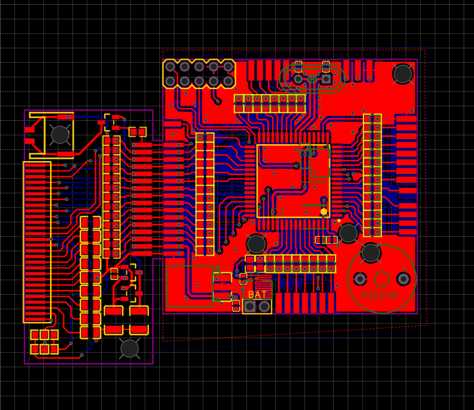

双创社 · FusionHEX 十六进制创科盟，隶属于上海海事大学技术转移中心，为集科创研发，人才培养为一 体的综合性科创交流平台。下分组织部，技术部与科创部。通过促进不同专业,不同领域创客之间的交流合作,致力于当代大学生科创爱好者技术水平以及创新能力的提升。

<!-- more -->

本社现有机架式服务器 12 台，包括 GPU 服务器、80 核心的众核 CPU 服务器、高频 CPU 服务器以及 VM 虚拟化服务器，免费向社员以及各路开发者免费开放，是目前唯一拥有私有算力机柜的学生社团，并与 RM 社、海智人工智能俱乐部、计算机学会等有着深入的合作。社内除了校内各界技术人才外，同时还拥有相当数量的校外社员，其中包括但不限于惠普工程师、前南方电网员工、专业网安人士以及具有 SSS+闲鱼独轮灵车驾驶经验的老司机。通过不同领域的技术交叉，促进科技创新项目的发展以及落地。（目前服务器正在维护中，日后会开放VM服务器）

**社团性质**    我社属于民间社团，活动主要以社员之间的技术交流为主。

**社团设备**    除上述服务器外，目前本社在灯塔附近实验室二楼还设有活动室，但因疫情原因暂时无法开放。

## 社团活动室内景

图1 实验室监控

图2-4 实验室内景

图5 前社长和服务器

## 社员部分作品

## 招新信息

今年的百团大战将改在线上进行，以下是我们的加入方式和往年的招新照片：

**加入方式**:进入QQ群，即可加入我们的活动和讨论

Email: [fhx@shmtuaa.org](mailto:fhx@shmtuaa.org)